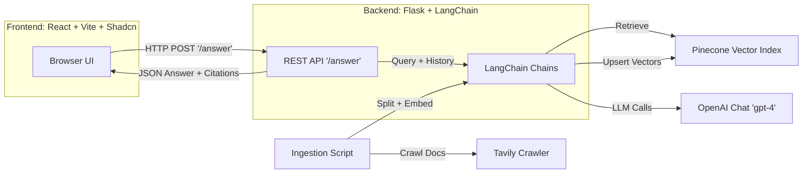

# LangChain Chat

A full‑stack Retrieval-Augmented Generation (RAG) app that lets you chat with the LangChain documentation. The backend crawls docs with Tavily, chunks and embeds content with OpenAI, stores vectors in Pinecone, and serves answers via a Flask API. The frontend is a React + Vite app (Shadcn UI) that displays responses with source citations. 🚀

## Features

- Retrieval-Augmented QA over LangChain docs (with source citations)
- History-aware retrieval (query rephrasing with chat history)
- Web crawling and ingestion via Tavily
- OpenAI embeddings (text-embedding-3-small) and Chat model (gpt-4)
- Pinecone vector store for scalable similarity search
- Graceful fallback to general LLM answers when no docs context is found
- Modern React UI (Vite + Shadcn) with dark mode 🌗
- Dockerized development (backend + frontend)
- CORS-ready for local development

## Quick Start

1) Set environment variables (see “Environment Variables” below).
2) Ingest documentation into Pinecone:
   - python ingestion.py
3) Run the backend:
   - python main.py
4) Run the frontend:
   - cd frontend && npm install && npm run dev
5) Open http://localhost:5173 and start chatting. ✨

Alternatively, use Docker Compose:
- docker-compose up --build

## Installation

Prerequisites:
- Python 3.11+
- Node.js 20+
- Accounts/API Keys for OpenAI, Pinecone, Tavily (LangSmith optional)

Clone and configure:
- git clone <your-repo>
- cd <your-repo>
- Copy .env and fill in keys

Backend (local):
- python -m venv .venv && source .venv/bin/activate  # Windows: .venv\Scripts\activate
- pip install -r requirements.txt

Frontend (local):
- cd frontend
- npm install

## Usage

Ingest the docs (creates/splits/embeds/upserts):
- python ingestion.py

Run the backend API (Flask on port 5000):
- python main.py

Run the frontend (Vite on port 5173):
- cd frontend
- npm run dev
- Visit http://localhost:5173

Docker (backend + frontend):
- docker-compose up --build
- Backend: http://localhost:5000
- Frontend: http://localhost:5173

Example API request:
- curl -s -X POST http://localhost:5000/answer \
  -H "Content-Type: application/json" \
  -d '{"query":"What is LangChain?","chat_history":[]}' | jq

Notes:
- The backend accepts chat_history as an array of messages with role and content. It appends the new user/AI turns and returns the updated history, plus sources and provenance.

## Environment Variables

Set these keys in .env:
- PINECONE_API_KEY
- INDEX_NAME
- OPENAI_API_KEY
- LANGSMITH_API_KEY
- LANGSMITH_TRACING
- TAVILY_API_KEY

Additional (optional):
- FLASK_SECRET_KEY

Tips:
- The ingestion script uses a default index name "langchain-doc-index". Ensure your INDEX_NAME matches your intended Pinecone index, or adjust ingestion.py as needed.
- Pinecone project/region setup should be complete before running ingestion.

## Architecture



## Project Structure

```
.
├─ .env
├─ Dockerfile
├─ docker-compose.yml
├─ requirements.txt
├─ main.py                 # Flask app + /answer route
├─ core.py                 # LLM + RAG chains and fallbacks
├─ ingestion.py            # Tavily crawl, split, embed, upsert to Pinecone
├─ logger.py               # Logging utilities (imported in code)
├─ frontend/
│  ├─ Dockerfile
│  ├─ package.json
│  └─ src/
│     ├─ App.jsx
│     ├─ main.jsx
│     └─ pages/
│        └─ HomePage.jsx
```

## How It Works

- Ingestion:
  - Crawls https://python.langchain.com/ (depth/breadth limits set)
  - Splits text into chunks (size 1000, overlap 150)
  - Embeds chunks with OpenAI and upserts to Pinecone

- Query:
  - A history-aware retriever rephrases user queries
  - Retrieves relevant chunks from Pinecone
  - Generates an answer with OpenAI Chat (gpt-4)
  - Returns citations if docs were used; otherwise falls back to general model answer

## Deployment

Docker Compose (development):
- docker-compose up --build

Containers:
- backend: Flask API on port 5000
- frontend: Vite dev server on port 5173

You can adapt Dockerfiles and compose settings for production (e.g., static build for frontend, gunicorn for backend).

## Troubleshooting

- Pinecone index:
  - Ensure your Pinecone environment is set up and the index name is correct.
- SSL certificates:
  - The ingestion script configures certifi/CA bundle; ensure outbound HTTPS is allowed.
- CORS:
  - The backend allows http://localhost:5173 and http://localhost:5174 by default (see main.py).
- Rate limits:
  - Tavily/OpenAI API limits may require adjusting batch sizes or limits in ingestion.py.

Happy building! 💚