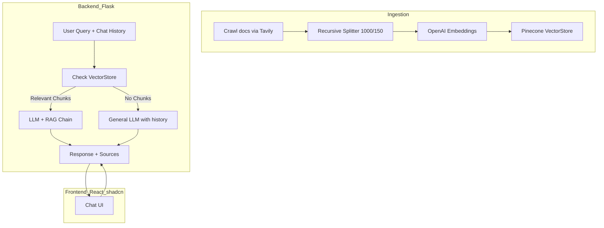

# 🧠 LangChain RAG Chat (Docs + Fallback LLM)

The following is create by https://github.com/Herc-Ch/readme-generator

A full-stack project that combines **Retrieval-Augmented Generation (RAG)** with fallback to a general LLM + conversation history when no relevant docs are retrieved (via similarity score threshold).

Built with **LangChain**, **Flask**, **Pinecone**, **OpenAI**, and a **React + shadcn UI**.

---

## ✨ Features

- 🔍 **RAG with similarity score threshold**

  - Queries docs first using Pinecone vector store.
  - Falls back to general LLM (with history) when no relevant chunks are found.

- 📚 **Custom ingestion pipeline**

  - Crawls [LangChain Python docs](https://python.langchain.com) with Tavily.
  - Splits, embeds (`text-embedding-3-small`), and stores in Pinecone.

- 💬 **Conversational UI**

  - React + shadcn frontend with chat history.
  - Code blocks rendered in black boxes with copy button.
  - Provenance badges (Docs vs Model-only) and citations.

- 🚀 **Full stack ready for Docker**
  - Flask backend serving `/answer` endpoint.
  - React frontend with Vite.
  - Env-based config for OpenAI, Pinecone, Tavily, LangSmith.

---

## 🏗️ Architecture



---

## ⚙️ Environment Variables

Create a `.env` file at the project root with the following keys:

```env
OPENAI_API_KEY=sk-...
PINECONE_API_KEY=pcsk-...
INDEX_NAME=langchain-doc-index
LANGSMITH_API_KEY=lsv2_...
LANGSMITH_TRACING=true
TAVILY_API_KEY=tvly-...
FLASK_SECRET_KEY=your-secret
```

### Run with Docker

From the project root:

```bash
docker-compose up --build
```

## 🛠️ Tech Stack

### Backend

- Flask (API server)

- LangChain (RAG, chains, prompts)

- Pinecone (vector DB)

- OpenAI (embeddings + chat LLM)

- Tavily (site crawler)

### Frontend

- React + Vite

- shadcn/ui + TailwindCSS

- react-markdown + prism-react-renderer

## Project Structure

```bash
├── core.py # RAG + fallback logic
├── ingestion.py # Crawl, split, embed, and store docs
├── logger.py # Colored logging helpers
├── main.py # Flask API entrypoint
├── requirements.txt # Backend dependencies
├── Dockerfile # Backend Dockerfile
├── docker-compose.yml # Compose for backend + frontend
├── frontend/
│ ├── Dockerfile # Frontend Dockerfile
│ ├── package.json
│ ├── vite.config.js
│ └── src/...
└── README.md
```

## 📂 Example Workflow

1. **Use Docker**
   ```bash
   docker-compose up --build
   ```
1. **Ingest docs**

   Run the ingestion script once to crawl and embed LangChain documentation into Pinecone:

   ```bash
   python ingestion.py
   ```

1. **Start backend & frontend**

   Either locally (see above) or with Docker Compose.

   ```bash
   # Local
   python main.py         # backend
   cd frontend && npm run dev   # frontend
   ```

1. **Query the app**

- Example queries:

  - “How do I build a retrieval chain in LangChain?” → docs-based answer (📖 From Docs).
  - “Who created Attack on Titan?” → fallback to general LLM (💡 General Answer).

## 💡Usage

1. Open the frontend at http://localhost:5173.

1. Ask a question in the chat UI.

1. If relevant docs are retrieved → the answer is grounded in docs (📖 From Docs badge).

1. If no relevant docs are found → the answer comes from the general LLM with history (💡 General Answer badge).

1. Citations are displayed as expandable lists under each AI answer.
