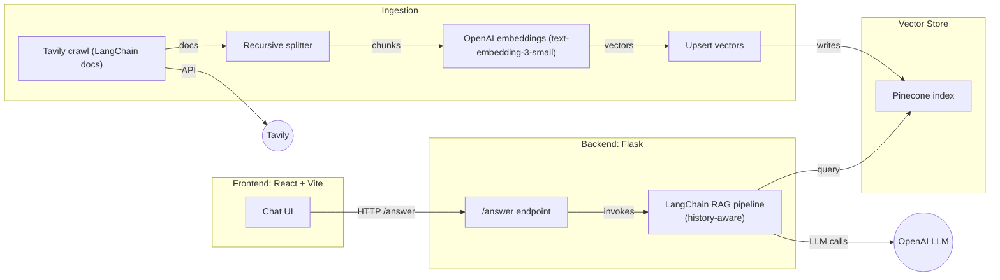

# LangChain Chat

A documentation-grounded chatbot for the LangChain ecosystem. It retrieves answers from the official docs with inline source attributions, keeps track of conversation context, and gracefully falls back to a general-purpose LLM when the knowledge base doesn’t apply.

## Why this project

This chatbot intelligently decides **when to use RAG and when not to**, instead of blindly querying the vector store on every request.

### 1️⃣ General question → **RAG skipped (threshold not met)**

The question is outside the LangChain documentation scope, so the system:
- skips retrieval
- answers using the base LLM
- marks provenance as `model_only`


---

### 2️⃣ Documentation-related question → **RAG activated**

The query matches the LangChain documentation with sufficient confidence:
- documents are retrieved from Pinecone
- sources are cited inline
- provenance is marked as `docs`


---

### 3️⃣ Follow-up question → **Fallback to general LLM with memory**

The user asks a meta-question:
> *"What was my first question?"*

This does not require retrieval, but **conversation memory is preserved**:
- RAG is skipped
- chat history is injected
- the assistant correctly recalls prior context


## Tech stack

- Backend: Python 3.11, Flask, LangChain
- LLM + embeddings: OpenAI (GPT‑4, text-embedding-3-small)
- Vector store: Pinecone
- Crawler: Tavily
- Frontend: React 19, Vite, shadcn/ui

## Architecture



## Getting started

Prerequisites:
- Python 3.11+
- Node.js 20+
- Accounts/API keys: OpenAI, Pinecone, Tavily
- A Pinecone index (1536 dimensions for text-embedding-3-small)

1) Configure environment

Create a .env file in the project root:
```
PINECONE_API_KEY=...
INDEX_NAME=...
OPENAI_API_KEY=...
LANGSMITH_API_KEY=...         # optional
LANGSMITH_TRACING=...         # optional
TAVILY_API_KEY=...
FLASK_SECRET_KEY=...          # optional
```
Tip: many setups default to INDEX_NAME="langchain-doc-index". Ensure your Pinecone index name matches your configuration.

2) Create a Pinecone index
- Name: your chosen name (e.g., langchain-doc-index)
- Dimension: 1536
- Metric: cosine

3) Install backend dependencies
```
python -m venv .venv
source .venv/bin/activate   # Windows: .venv\Scriptsctivate
pip install --upgrade pip
pip install -r requirements.txt
```

4) Ingest the documentation
```
python ingestion.py
```
Run this when setting up the project and anytime you want to refresh the knowledge base.

5) Start the API
```
python main.py
```
The server listens on http://localhost:5000

6) Start the frontend
```
cd frontend
npm install
npm run dev
```
The app is available at http://localhost:5173

## Docker

Use Docker Compose to run the full stack in one go:
```
docker-compose up --build
```
- Backend: http://localhost:5000
- Frontend: http://localhost:5173

Ensure the .env file (with required keys) exists in the project root before starting.

## API reference

POST /answer
- Request body:
  - query: string
  - chat_history: array of messages, e.g. [{ "role": "human"|"ai", "content": string }]
- Response body:
  - answer: string
  - chat_history: updated history including the latest exchange
  - sources: array of URLs when documentation was used
  - provenance: "docs" | "model_only"
  - model_name: string

Example:
```
curl -X POST http://localhost:5000/answer   -H "Content-Type: application/json"   -d '{"query":"What is a retriever in LangChain?","chat_history":[]}'
```

## Configuration

Environment variables:
- PINECONE_API_KEY
- INDEX_NAME
- OPENAI_API_KEY
- LANGSMITH_API_KEY (optional)
- LANGSMITH_TRACING (optional)
- TAVILY_API_KEY
- FLASK_SECRET_KEY (optional)

Notes:
- Make sure the Pinecone index name in your ingestion script matches INDEX_NAME.
- The backend can stream tokens internally; the sample UI renders the final answer by default.
- CORS is configured to allow requests from the Vite dev server at localhost:5173.

## Troubleshooting

- Pinecone dimension mismatch: confirm your index uses 1536 dimensions for text-embedding-3-small.
- Empty answers or no sources: verify ingestion finished successfully and that your index is non-empty.
- Authentication errors: double-check OpenAI, Pinecone, and Tavily API keys are present and valid.
- Rate limits: reduce concurrency or add backoff; consult provider dashboards.

Happy building! 🚀
